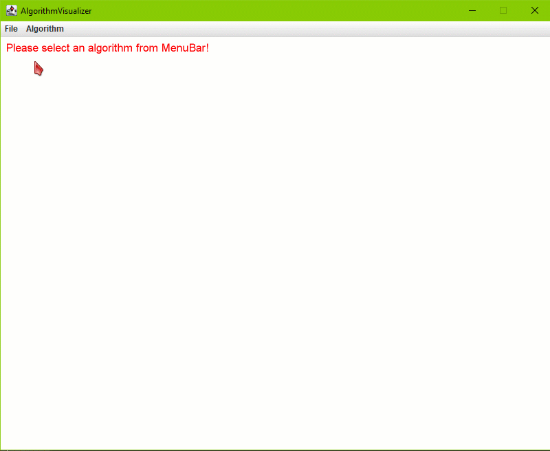
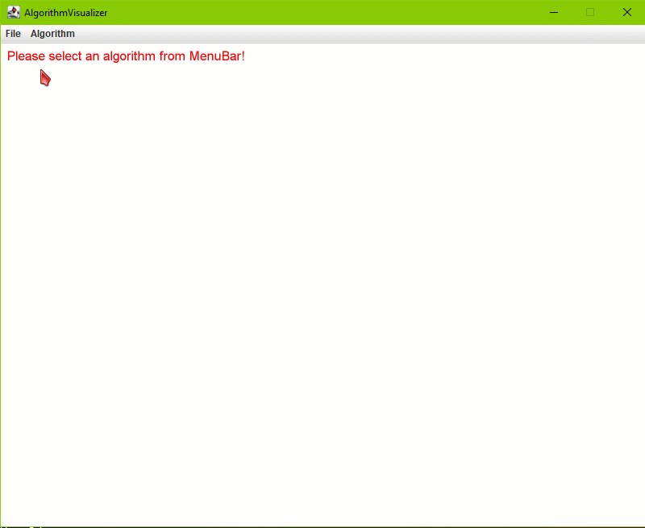

# viRz
viRz is yet another algorithms visualizer, written in Java.  
- It generates random (but constrained) input data then operates on them, check [Visualizer.java](src/Visualizer.java)  
- Visualization is done using a slightly modified version of [StdDraw](https://algs4.cs.princeton.edu/code/edu/princeton/cs/algs4/StdDraw.java.html)  

Project is under development and is made for education, training and fun.  
  
## Algorithms visualized (until now)    
- [Depth-First-Search](https://en.wikipedia.org/wiki/Depth-first_search)  
&nbsp;&nbsp;  
&nbsp;&nbsp;&nbsp;&nbsp; 
- [Breadth-First-Search](https://en.wikipedia.org/wiki/Breadth-first_search)  
&nbsp;&nbsp;  
&nbsp;&nbsp;&nbsp;&nbsp; 
- [Kruskal's Minimum Spanning Tree](https://en.wikipedia.org/wiki/Kruskal%27s_algorithm)    
&nbsp;&nbsp;  
&nbsp;&nbsp;&nbsp;&nbsp; 
- [Prim's Minimum Spanning Tree](https://en.wikipedia.org/wiki/Prim%27s_algorithm)  
&nbsp;&nbsp;  
&nbsp;&nbsp;&nbsp;&nbsp; 
